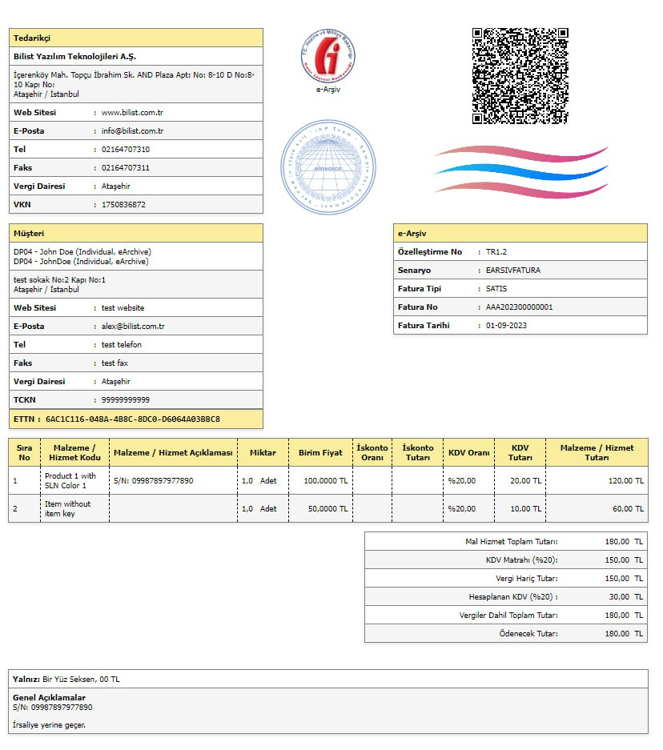

# eFaturaXSLT
XSLT şablonu eFatura ve eArşiv için tasarlanmıştır. Basitleştirilmiş stillerle, şirket imzası ve logosu ekleyebilme özelliği. Ayrıca yazıyla toplam tutar da var.

## Bu şablon aşağıdaki entegratörlerde test edilmiştir:
- DigitalPlanet
- Turmob
- QNB
- Logo
- Izibiz
- Uyumsoft

## Şablon Hakkında:
- **QR Kodu**: Şablona gömülü
- **Şirket Logosu**: Var
- **Şirket İmzası**: Var
- **Dış Görünüm**: CSS stili aracılığıyla değiştirilebilir
- **Yazıyla Toplam Tutar**: Şablona gömülü kod
- **Tek Şablon**: eFatura ve eArşiv için

### Ek Bilgi
Şablon önemli ölçüde basitleştirilmiş, normal bir stile getirilmiş, tamamen geçerli bir XSLT'dir. Tüm stiller kaldırılmış ve stil başlığına taşınmıştır.

